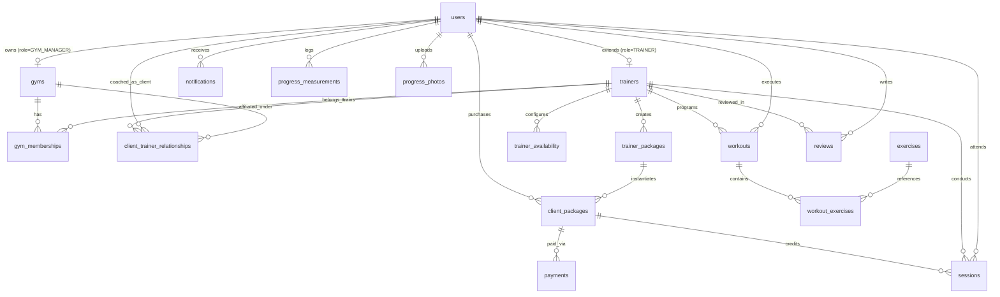

# Database Plan & Schema Design

**Project:** FitTrainer (Fitness Trainer Platform)  
**Version:** 1.0  
**Target Engine:** PostgreSQL 15+ (Supabase)  
**Architecture:** Multi-Tenant Relational Model with Row-Level Security (RLS)  

---

## 1. Entity-Relationship Overview



---

## 2. Table Specifications & DDL Definitions

### 2.1 `users`
Core user identity and authentication profile.
```sql
CREATE TYPE user_role AS ENUM ('SUPER_ADMIN', 'GYM_MANAGER', 'HEAD_TRAINER', 'TRAINER', 'CLIENT');
CREATE TYPE user_status AS ENUM ('ACTIVE', 'INACTIVE', 'SUSPENDED', 'PENDING_VERIFICATION');

CREATE TABLE users (
    id UUID PRIMARY KEY DEFAULT gen_random_uuid(),
    auth_id UUID UNIQUE, -- References auth.users.id in Supabase
    role user_role NOT NULL,
    name VARCHAR(255) NOT NULL,
    email VARCHAR(255) UNIQUE NOT NULL,
    mobile VARCHAR(50),
    profile_photo TEXT,
    status user_status NOT NULL DEFAULT 'ACTIVE',
    share_personal_info_with_trainer BOOLEAN NOT NULL DEFAULT FALSE,
    age INT,
    gender VARCHAR(50),
    height_cm NUMERIC(5,2),
    weight_kg NUMERIC(5,2),
    fitness_goal TEXT,
    fitness_level VARCHAR(50),
    injuries TEXT,
    medical_information TEXT,
    exercise_restrictions TEXT,
    dietary_information TEXT,
    emergency_contact VARCHAR(255),
    created_at TIMESTAMPTZ NOT NULL DEFAULT NOW(),
    updated_at TIMESTAMPTZ NOT NULL DEFAULT NOW()
);

CREATE INDEX idx_users_role ON users(role);
CREATE INDEX idx_users_email ON users(email);
```

---

### 2.2 `trainers`
Extended professional profile for personal trainers.
```sql
CREATE TYPE verification_status AS ENUM ('UNVERIFIED', 'PENDING', 'VERIFIED', 'REJECTED');
CREATE TYPE cancellation_policy_mode AS ENUM ('NO_PENALTY', 'FOUR_HOUR_POLICY', 'CUSTOM');

CREATE TABLE trainers (
    id UUID PRIMARY KEY DEFAULT gen_random_uuid(),
    user_id UUID NOT NULL UNIQUE REFERENCES users(id) ON DELETE CASCADE,
    verification_status verification_status NOT NULL DEFAULT 'UNVERIFIED',
    bio TEXT,
    experience_years INT NOT NULL DEFAULT 0,
    certifications TEXT[], -- e.g. ARRAY['NASM-CPT', 'ACE']
    specializations TEXT[], -- e.g. ARRAY['Weight Loss', 'Hypertrophy']
    languages TEXT[],
    location VARCHAR(255),
    training_style TEXT,
    trainer_code VARCHAR(32) UNIQUE NOT NULL,
    qr_code TEXT,
    upi_id VARCHAR(100),
    mobile_payment_number VARCHAR(50),
    cancellation_policy cancellation_policy_mode NOT NULL DEFAULT 'NO_PENALTY',
    custom_cancellation_hours INT DEFAULT 4,
    trial_start_date TIMESTAMPTZ DEFAULT NOW(),
    trial_end_date TIMESTAMPTZ DEFAULT (NOW() + INTERVAL '365 days'),
    created_at TIMESTAMPTZ NOT NULL DEFAULT NOW(),
    updated_at TIMESTAMPTZ NOT NULL DEFAULT NOW()
);

CREATE INDEX idx_trainers_code ON trainers(trainer_code);
CREATE INDEX idx_trainers_verification ON trainers(verification_status);
```

---

### 2.3 `gyms` & `gym_memberships`
Multi-tenant organizational structure.
```sql
CREATE TABLE gyms (
    id UUID PRIMARY KEY DEFAULT gen_random_uuid(),
    name VARCHAR(255) NOT NULL,
    owner_id UUID NOT NULL REFERENCES users(id) ON DELETE RESTRICT,
    address TEXT,
    contact VARCHAR(100),
    status VARCHAR(50) NOT NULL DEFAULT 'ACTIVE',
    created_at TIMESTAMPTZ NOT NULL DEFAULT NOW(),
    updated_at TIMESTAMPTZ NOT NULL DEFAULT NOW()
);

CREATE TABLE gym_memberships (
    id UUID PRIMARY KEY DEFAULT gen_random_uuid(),
    gym_id UUID NOT NULL REFERENCES gyms(id) ON DELETE CASCADE,
    trainer_id UUID NOT NULL REFERENCES trainers(id) ON DELETE CASCADE,
    role user_role NOT NULL DEFAULT 'TRAINER', -- 'HEAD_TRAINER' or 'TRAINER'
    status VARCHAR(50) NOT NULL DEFAULT 'ACTIVE',
    created_at TIMESTAMPTZ NOT NULL DEFAULT NOW(),
    UNIQUE(gym_id, trainer_id)
);
```

---

### 2.4 `client_trainer_relationships`
Relationship binding and lifecycle state.
```sql
CREATE TYPE relationship_status AS ENUM (
    'REQUESTED', 'PENDING', 'ACCEPTED', 'REJECTED', 'SUSPENDED', 'ENDED', 'REASSIGNED'
);

CREATE TABLE client_trainer_relationships (
    id UUID PRIMARY KEY DEFAULT gen_random_uuid(),
    client_id UUID NOT NULL REFERENCES users(id) ON DELETE CASCADE,
    trainer_id UUID NOT NULL REFERENCES trainers(id) ON DELETE CASCADE,
    gym_id UUID REFERENCES gyms(id) ON DELETE SET NULL,
    relationship_status relationship_status NOT NULL DEFAULT 'REQUESTED',
    is_primary BOOLEAN NOT NULL DEFAULT TRUE,
    assigned_by UUID REFERENCES users(id) ON DELETE SET NULL, -- Head trainer / Gym manager
    consultation_notes TEXT,
    start_date TIMESTAMPTZ,
    end_date TIMESTAMPTZ,
    created_at TIMESTAMPTZ NOT NULL DEFAULT NOW(),
    updated_at TIMESTAMPTZ NOT NULL DEFAULT NOW()
);

CREATE INDEX idx_rel_client_trainer ON client_trainer_relationships(client_id, trainer_id);
```

---

### 2.5 `trainer_packages` & `client_packages`
Package catalog and client balance ledger.
```sql
CREATE TYPE validity_mode AS ENUM ('SESSIONS_MULTIPLIED_BY_4', 'SESSIONS_MULTIPLIED_BY_3', 'FIXED_DAYS', 'CUSTOM');
CREATE TYPE package_status AS ENUM ('DRAFT', 'ACTIVE', 'INACTIVE', 'EXPIRED', 'SOLD_OUT');

CREATE TABLE trainer_packages (
    id UUID PRIMARY KEY DEFAULT gen_random_uuid(),
    trainer_id UUID NOT NULL REFERENCES trainers(id) ON DELETE CASCADE,
    gym_id UUID REFERENCES gyms(id) ON DELETE CASCADE,
    name VARCHAR(255) NOT NULL,
    description TEXT,
    sessions INT NOT NULL CHECK (sessions > 0),
    price NUMERIC(10,2) NOT NULL CHECK (price >= 0),
    validity_days INT NOT NULL CHECK (validity_days > 0),
    validity_mode validity_mode NOT NULL DEFAULT 'SESSIONS_MULTIPLIED_BY_4',
    session_duration INT NOT NULL DEFAULT 60, -- minutes
    status package_status NOT NULL DEFAULT 'ACTIVE',
    created_at TIMESTAMPTZ NOT NULL DEFAULT NOW()
);

CREATE TYPE client_package_status AS ENUM ('PENDING_PAYMENT', 'ACTIVE', 'EXPIRED', 'COMPLETED', 'CANCELLED');

CREATE TABLE client_packages (
    id UUID PRIMARY KEY DEFAULT gen_random_uuid(),
    client_id UUID NOT NULL REFERENCES users(id) ON DELETE CASCADE,
    trainer_id UUID NOT NULL REFERENCES trainers(id) ON DELETE CASCADE,
    package_id UUID NOT NULL REFERENCES trainer_packages(id) ON DELETE RESTRICT,
    total_sessions INT NOT NULL,
    completed_sessions INT NOT NULL DEFAULT 0,
    remaining_sessions INT NOT NULL,
    purchase_date TIMESTAMPTZ NOT NULL DEFAULT NOW(),
    activation_date TIMESTAMPTZ,
    expiry_date TIMESTAMPTZ NOT NULL,
    payment_status VARCHAR(50) NOT NULL DEFAULT 'VERIFICATION_REQUIRED',
    status client_package_status NOT NULL DEFAULT 'PENDING_PAYMENT',
    created_at TIMESTAMPTZ NOT NULL DEFAULT NOW()
);

CREATE INDEX idx_client_packages_balance ON client_packages(client_id, remaining_sessions, status);
```

---

### 2.6 `payments`
Offline & future gateway payment ledger.
```sql
CREATE TYPE payment_status AS ENUM ('PENDING', 'VERIFICATION_REQUIRED', 'PAID', 'REJECTED', 'REFUNDED');
CREATE TYPE payment_method AS ENUM ('UPI', 'BANK_TRANSFER', 'CASH', 'ONLINE_GATEWAY');

CREATE TABLE payments (
    id UUID PRIMARY KEY DEFAULT gen_random_uuid(),
    client_id UUID NOT NULL REFERENCES users(id) ON DELETE CASCADE,
    trainer_id UUID NOT NULL REFERENCES trainers(id) ON DELETE CASCADE,
    package_id UUID NOT NULL REFERENCES trainer_packages(id) ON DELETE RESTRICT,
    client_package_id UUID REFERENCES client_packages(id) ON DELETE CASCADE,
    amount NUMERIC(10,2) NOT NULL,
    payment_method payment_method NOT NULL DEFAULT 'UPI',
    payment_status payment_status NOT NULL DEFAULT 'VERIFICATION_REQUIRED',
    transaction_reference VARCHAR(255),
    notes TEXT,
    created_at TIMESTAMPTZ NOT NULL DEFAULT NOW(),
    verified_at TIMESTAMPTZ,
    verified_by UUID REFERENCES users(id)
);
```

---

### 2.7 `trainer_availability` & `sessions`
Scheduling, capacity, and credit consumption tracking.
```sql
CREATE TABLE trainer_availability (
    id UUID PRIMARY KEY DEFAULT gen_random_uuid(),
    trainer_id UUID NOT NULL REFERENCES trainers(id) ON DELETE CASCADE,
    day_of_week INT NOT NULL CHECK (day_of_week BETWEEN 0 AND 6), -- 0=Sunday
    start_time TIME NOT NULL,
    end_time TIME NOT NULL,
    capacity INT NOT NULL DEFAULT 1,
    is_recurring BOOLEAN NOT NULL DEFAULT TRUE,
    created_at TIMESTAMPTZ NOT NULL DEFAULT NOW()
);

CREATE TYPE session_type AS ENUM ('PERSONAL_TRAINING', 'OWN_WORKOUT');
CREATE TYPE session_status AS ENUM (
    'REQUESTED', 'CONFIRMED', 'SCHEDULED', 'IN_PROGRESS', 'COMPLETED', 'CANCELLED', 'RESCHEDULED', 'NO_SHOW'
);

CREATE TABLE sessions (
    id UUID PRIMARY KEY DEFAULT gen_random_uuid(),
    client_id UUID NOT NULL REFERENCES users(id) ON DELETE CASCADE,
    trainer_id UUID REFERENCES trainers(id) ON DELETE SET NULL, -- Null for Own Workouts
    gym_id UUID REFERENCES gyms(id) ON DELETE SET NULL,
    client_package_id UUID REFERENCES client_packages(id) ON DELETE SET NULL,
    session_type session_type NOT NULL DEFAULT 'PERSONAL_TRAINING',
    scheduled_start TIMESTAMPTZ NOT NULL,
    scheduled_end TIMESTAMPTZ NOT NULL,
    status session_status NOT NULL DEFAULT 'REQUESTED',
    credit_consumed BOOLEAN NOT NULL DEFAULT FALSE,
    cancellation_reason TEXT,
    notes TEXT,
    created_at TIMESTAMPTZ NOT NULL DEFAULT NOW(),
    updated_at TIMESTAMPTZ NOT NULL DEFAULT NOW()
);

CREATE INDEX idx_sessions_time ON sessions(trainer_id, scheduled_start, scheduled_end);
```

---

### 2.8 `exercises`, `workouts` & `workout_exercises`
Exercise catalog, templates, and assigned workout logs.
```sql
CREATE TYPE exercise_category AS ENUM (
    'CHEST', 'BACK', 'SHOULDERS', 'BICEPS', 'TRICEPS', 'FOREARMS', 
    'QUADRICEPS', 'HAMSTRINGS', 'GLUTES', 'HIPS', 'CALVES', 'CORE', 'FULL_BODY'
);
CREATE TYPE exercise_type AS ENUM ('COMPOUND', 'ISOLATION', 'BODYWEIGHT', 'CARDIO', 'MOBILITY', 'STRETCHING');

CREATE TABLE exercises (
    id UUID PRIMARY KEY DEFAULT gen_random_uuid(),
    name VARCHAR(255) NOT NULL,
    category exercise_category NOT NULL,
    description TEXT,
    target_muscles TEXT[],
    equipment VARCHAR(100),
    exercise_type exercise_type NOT NULL DEFAULT 'COMPOUND',
    difficulty VARCHAR(50) NOT NULL DEFAULT 'INTERMEDIATE',
    instructions TEXT,
    media_url TEXT,
    created_by UUID REFERENCES trainers(id) ON DELETE SET NULL, -- Null = Global
    is_global BOOLEAN NOT NULL DEFAULT TRUE
);

CREATE TABLE workouts (
    id UUID PRIMARY KEY DEFAULT gen_random_uuid(),
    trainer_id UUID REFERENCES trainers(id) ON DELETE SET NULL, -- Null for Client Own Workouts
    client_id UUID NOT NULL REFERENCES users(id) ON DELETE CASCADE,
    name VARCHAR(255) NOT NULL,
    description TEXT,
    workout_type VARCHAR(50) NOT NULL DEFAULT 'ASSIGNED', -- 'ASSIGNED', 'TEMPLATE', 'OWN_WORKOUT'
    assigned_date DATE,
    status VARCHAR(50) NOT NULL DEFAULT 'PENDING', -- 'PENDING', 'IN_PROGRESS', 'COMPLETED'
    created_at TIMESTAMPTZ NOT NULL DEFAULT NOW()
);

CREATE TABLE workout_exercises (
    id UUID PRIMARY KEY DEFAULT gen_random_uuid(),
    workout_id UUID NOT NULL REFERENCES workouts(id) ON DELETE CASCADE,
    exercise_id UUID NOT NULL REFERENCES exercises(id) ON DELETE RESTRICT,
    sequence INT NOT NULL DEFAULT 1,
    sets INT NOT NULL DEFAULT 3,
    repetitions INT NOT NULL DEFAULT 10,
    weight_kg NUMERIC(6,2) DEFAULT 0,
    duration_seconds INT DEFAULT 0,
    rest_time_seconds INT DEFAULT 60,
    notes TEXT
);
```

---

### 2.9 `progress_measurements`, `progress_photos`, `reviews`, `notifications`, `feature_flags`

```sql
CREATE TABLE progress_measurements (
    id UUID PRIMARY KEY DEFAULT gen_random_uuid(),
    client_id UUID NOT NULL REFERENCES users(id) ON DELETE CASCADE,
    recorded_by UUID NOT NULL REFERENCES users(id),
    measurement_date DATE NOT NULL DEFAULT CURRENT_DATE,
    weight_kg NUMERIC(5,2),
    height_cm NUMERIC(5,2),
    bmi NUMERIC(4,2),
    body_fat_percentage NUMERIC(4,2),
    chest_cm NUMERIC(5,2),
    waist_cm NUMERIC(5,2),
    hips_cm NUMERIC(5,2),
    biceps_cm NUMERIC(5,2),
    thighs_cm NUMERIC(5,2),
    calves_cm NUMERIC(5,2),
    neck_cm NUMERIC(5,2),
    notes TEXT,
    created_at TIMESTAMPTZ NOT NULL DEFAULT NOW()
);

CREATE TABLE progress_photos (
    id UUID PRIMARY KEY DEFAULT gen_random_uuid(),
    client_id UUID NOT NULL REFERENCES users(id) ON DELETE CASCADE,
    photo_type VARCHAR(50) NOT NULL, -- 'FRONT', 'SIDE', 'BACK'
    storage_path TEXT NOT NULL,
    uploaded_at TIMESTAMPTZ NOT NULL DEFAULT NOW()
);

CREATE TABLE reviews (
    id UUID PRIMARY KEY DEFAULT gen_random_uuid(),
    client_id UUID NOT NULL REFERENCES users(id) ON DELETE CASCADE,
    trainer_id UUID NOT NULL REFERENCES trainers(id) ON DELETE CASCADE,
    rating INT NOT NULL CHECK (rating BETWEEN 1 AND 5),
    review_text TEXT,
    status VARCHAR(50) NOT NULL DEFAULT 'PUBLISHED',
    created_at TIMESTAMPTZ NOT NULL DEFAULT NOW(),
    UNIQUE(client_id, trainer_id)
);

CREATE TABLE notifications (
    id UUID PRIMARY KEY DEFAULT gen_random_uuid(),
    user_id UUID NOT NULL REFERENCES users(id) ON DELETE CASCADE,
    type VARCHAR(100) NOT NULL,
    title VARCHAR(255) NOT NULL,
    message TEXT NOT NULL,
    read BOOLEAN NOT NULL DEFAULT FALSE,
    created_at TIMESTAMPTZ NOT NULL DEFAULT NOW()
);

CREATE TABLE feature_flags (
    id UUID PRIMARY KEY DEFAULT gen_random_uuid(),
    key VARCHAR(100) UNIQUE NOT NULL,
    enabled BOOLEAN NOT NULL DEFAULT FALSE,
    description TEXT,
    updated_by UUID REFERENCES users(id),
    updated_at TIMESTAMPTZ NOT NULL DEFAULT NOW()
);
```

---

## 3. Row-Level Security (RLS) Policy Specifications

### `users` Table RLS
- **`SELECT`**: Any authenticated user can read public trainer details. Private profile data is restricted: `auth.uid() = auth_id` OR user is an active assigned trainer with `share_personal_info_with_trainer = true`.
- **`UPDATE`**: `auth.uid() = auth_id` OR `auth.jwt() ->> 'role' = 'SUPER_ADMIN'`.

### `progress_measurements` & `progress_photos` RLS
- **`SELECT` / `INSERT`**:
  ```sql
  (auth.uid() = client_id) OR
  EXISTS (
      SELECT 1 FROM client_trainer_relationships r
      JOIN trainers t ON t.id = r.trainer_id
      WHERE r.client_id = progress_measurements.client_id
        AND t.user_id = auth.uid()
        AND r.relationship_status = 'ACCEPTED'
  )
  ```
