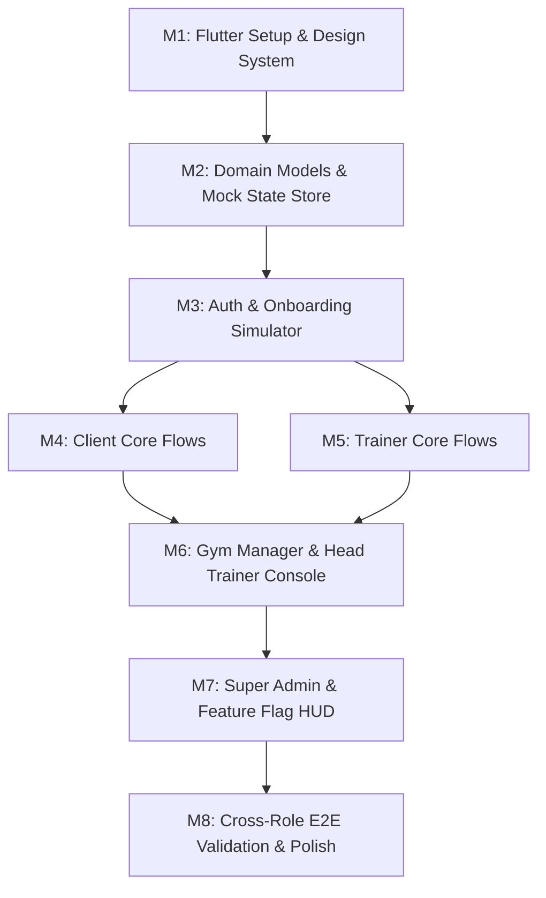

# Stage 1 Implementation Plan: Interactive High-Fidelity Prototype

**Project:** FitTrainer (Fitness Trainer Platform)  
**Version:** 1.0  
**Phase:** Stage 1 – Interactive Frontend Prototype (Flutter) with In-Memory Mock Data  
**Target Completion:** Ready for Stakeholder Walkthrough & UX Validation  

---

## 1. Scope & Technical Constraints for Stage 1

In accordance with solution architecture guidelines, Stage 1 will deliver a **fully functional, interactive mobile-first prototype** running locally in Flutter, without external backend dependencies.

### Strict Boundaries:
- 🚫 **No Supabase / Remote DB**: All data structures live in a reactive in-memory state repository.
- 🚫 **No Live SMS / OAuth Gateways**: Instant simulated OTP verification and one-click role switching.
- 🚫 **No Real Payment Gateways**: Offline payment workflow with simulated transaction IDs and trainer verification.
- 🚫 **No External Push Notification Services**: Interactive in-app notification center and live badge simulation.
- ✅ **Realistic Mock Data**: Pre-seeded with 5 authentic user accounts across all roles, 100+ exercises, sample workout templates, booked sessions, and historical progress charts.
- ✅ **Complete Business Logic Simulation**: Credit deduction, 4-hour cancellation rule evaluation, capacity limits, and role permission guards.

---

## 2. Implementation Milestones

---

### Milestone 1: Project Setup, Design System & Core UI Components
- **Goal**: Establish the Flutter project structure, theme engine, typography, and reusable design components.
- **Deliverables**:
  1. Flutter application scaffolding in `app/` with clean architecture folder structure (`core/`, `data/`, `domain/`, `features/`).
  2. Dark and Light theme configurations with dynamic theme switcher (`core/theme/`).
  3. Reusable UI library:
     - `FitnessCard`, `MetricTile`, `StatGauge`, `WorkoutCard`, `SessionBadge`.
     - `CustomButton`, `CustomTextField`, `PillFilterBar`, `ProgressRing`.
     - Floating Test Account / Role Switcher HUD.
- **Verification**: UI component gallery page running and responsive across mobile and tablet viewports.

---

### Milestone 2: Mock Domain Models, Repositories & Seed Fixtures
- **Goal**: Implement all in-memory domain models, business logic evaluators, and realistic seed data.
- **Deliverables**:
  1. Immutable domain models for Users, Trainers, Gyms, Relationships, Packages, Sessions, Workouts, Exercises, Measurements, Reviews, Notifications, and Feature Flags.
  2. In-memory reactive state repositories (`MockStateRepository`) with reactive stream/notify listeners.
  3. Pre-loaded seed fixtures:
     - 5 Test Accounts (`admin@test.local`, `gymmanager@test.local`, `headtrainer@test.local`, `trainer@test.local`, `client@test.local`).
     - 100+ standard global exercises with categorized muscle groups.
     - Active client-trainer relationships with booked sessions and active packages.
     - 6-month historical weight and measurement data points with charts.
- **Verification**: Unit tests / sanity checks confirming all test accounts load and in-memory state mutations persist across screen transitions.

---

### Milestone 3: Authentication, Role Selection & Onboarding Simulator
- **Goal**: Deliver a smooth, realistic onboarding experience for trainers and clients.
- **Deliverables**:
  1. **Splash Screen (`AUTH-01`)** with branded animations and initial routing.
  2. **Login Screen (`AUTH-02`)** featuring one-tap login for all 5 test accounts.
  3. **OTP Simulator (`AUTH-03`)** with auto-fill mock code `123456`.
  4. **Role Selection (`AUTH-04`)** for new user simulation.
  5. **Trainer Onboarding Wizard (`AUTH-05`)**: Multi-step profile setup (Bio, Certifications, Specializations, Working Hours, Cancellation Policy).
  6. **Client Onboarding Wizard (`AUTH-06`)**: Health intake, goals, medical history, and trainer data sharing opt-in toggle.
- **Verification**: Complete signup flow from splash $\to$ login $\to$ onboarding wizard $\to$ dashboard for both Trainer and Client.

---

### Milestone 4: Client Core Experience & Workouts
- **Goal**: Implement the complete client journey from discovery to live workout execution and progress tracking.
- **Deliverables**:
  1. **Client Dashboard (`CLI-01`)**: Next session countdown, remaining credits gauge, today's workout preview, active trainer banner.
  2. **Trainer Discovery & QR Scanner (`CLI-02`, `CLI-03`, `CLI-04`)**: Search verified trainers, filter by specialization, scan trainer QR code.
  3. **Consultation & Package Purchase (`CLI-05` to `CLI-08`)**: Request consultation, select package, view trainer UPI details, submit offline payment reference.
  4. **Session Booking (`CLI-10`)**: Interactive calendar slot selector with live capacity and credit validation checks.
  5. **Live Workout Tracker & "Own Workouts" (`CLI-11`, `CLI-12`, `CLI-13`)**:
     - Assigned workout routine with set/rep/weight checklists and rest stopwatch timer.
     - "Own Workout" logger clearly marked with zero PT credit deduction.
  6. **Progress Tracking & Photos (`CLI-15`, `CLI-16`, `CLI-17`)**: Body measurement charts, BMI calculator, private photo gallery.
  7. **Trainer Review Modal (`CLI-18`)**: 5-star rating and written review submission.
- **Verification**: Client books a session, completes an assigned workout, logs an own workout, checks progress charts, and purchases a package.

---

### Milestone 5: Trainer Core Experience & Management
- **Goal**: Implement the complete trainer command center, scheduling, workout programming, and client progress oversight.
- **Deliverables**:
  1. **Trainer Dashboard (`TRN-01`)**: Daily briefing, today's sessions list, pending requests counter, revenue metrics, credit exhaustion alerts.
  2. **Client Roster & 360 Detail (`TRN-03` to `TRN-06`)**: Search clients, view package balances, inspect workout history, view client medical data (respecting opt-in privacy).
  3. **Calendar & Schedule (`TRN-07`, `TRN-08`)**: Weekly slot calendar, session detail modal (Start, Complete, Cancel, Reschedule with 4-hour policy evaluation).
  4. **Workout Builder & Exercise Catalog (`TRN-09` to `TRN-12`)**: Reusable template builder, exercise search, custom exercise creator, drag-and-drop routine assigner.
  5. **Package & Payment Manager (`TRN-13`, `TRN-14`)**: Create custom packages (with 4x validity calculator), approve/reject client offline payments.
  6. **Availability & Capacity Editor (`TRN-15`)**: Set working hours, slot capacity limits, and cancellation policy modes (`NO_PENALTY`, `FOUR_HOUR_POLICY`, `CUSTOM`).
- **Verification**: Trainer creates a workout template, assigns it to a client, approves an offline payment, marks a session completed, and verifies credit deduction.

---

### Milestone 6: Gym Manager & Head Trainer Console
- **Goal**: Deliver the multi-tenant gym oversight console and client reassignment system.
- **Deliverables**:
  1. **Gym Dashboard (`GYM-01`)**: Facility-level KPIs (Total trainers, active clients, sessions completed today, revenue).
  2. **Trainers Directory (`GYM-02`)**: Staff roster, client load per trainer, trainer performance metrics.
  3. **Head Trainer Client Reassignment Console (`GYM-03`, `GYM-04`, `GYM-05`)**:
     - Gym-wide client roster.
     - Interactive modal to transfer a client from Trainer A to Trainer B while preserving past historical workout logs.
  4. **Gym Master Calendar (`GYM-06`)**: Multi-trainer facility schedule grid.
  5. **Gym Financial Reports (`GYM-08`)**: Revenue breakdown and package sales reports.
- **Verification**: Head Trainer reassigns a client between two trainers and verifies that workout history remains intact.

---

### Milestone 7: Super Admin & Feature Flag Simulator
- **Goal**: Provide full global platform controls and runtime configuration switches.
- **Deliverables**:
  1. **Admin Dashboard (`ADM-01`)**: Global metrics, system health overview.
  2. **Trainer Verification Queue (`ADM-03`)**: Review trainer certifications, approve/reject public discovery status.
  3. **Feature Flags Console (`ADM-07`)**: Runtime toggles for:
     - `online_payments`
     - `advanced_trainer_search`
     - `trial_payment_requirement`
     - `client_personal_information`
     - `trainer_reviews`
     - `whatsapp_notifications`
  4. **Interactive Development HUD**: Persistent floating widget allowing instant role switching between all 5 test accounts and one-tap mock data reset.
- **Verification**: Toggling feature flags immediately updates UI capabilities (e.g. toggling `trainer_reviews` hides/shows review buttons).

---

### Milestone 8: Cross-Role Flow Polish & User Acceptance Testing
- **Goal**: Comprehensive end-to-end testing of interconnected cross-role workflows.
- **Deliverables**:
  1. End-to-end walkthrough verification:
     - Client requests consultation $\to$ Trainer accepts $\to$ Client buys package $\to$ Trainer verifies payment $\to$ Client books session $\to$ Trainer completes session $\to$ Credit balance decrements from 10 to 9 $\to$ Client reviews trainer.
  2. Smooth animations, error state handling, empty states, and toast notifications.
  3. Creation of complete walkthrough guide with screenshots and user journeys.
- **Verification**: Complete pass on all MVP acceptance criteria defined in `docs/product-spec-v1.json`.
