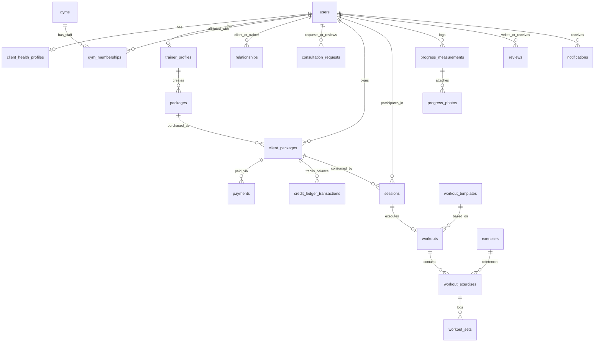

# FitTrainer (myPT) — Stage 2.0 Entity Relationship Diagram (ERD)

**Project:** FitTrainer (Fitness Trainer Platform)  
**Version:** 2.0 Production Schema  
**Date:** August 31, 2026  

---

## 1. High-Level Entity Architecture

---

## 2. Detailed Database Relational ERD

```mermaid
erDiagram
    users {
        uuid id PK
        uuid auth_id
        varchar email
        varchar name
        user_role_type role
        boolean is_active
        timestamptz created_at
    }

    client_health_profiles {
        uuid id PK
        uuid user_id FK
        numeric height_cm
        numeric weight_kg
        text fitness_goal
        text injuries
        text medical_info
        boolean share_personal_info_with_trainer
    }

    trainer_profiles {
        uuid id PK
        uuid user_id FK
        varchar trainer_code UK
        int years_experience
        numeric rating
        trainer_verification_status verification_status
        boolean is_independent
        int cancellation_grace_hours
        boolean late_cancellation_penalty_enabled
    }

    gyms {
        uuid id PK
        varchar name
        varchar slug UK
        int floor_capacity
        text operating_hours
        boolean is_active
    }

    gym_memberships {
        uuid id PK
        uuid gym_id FK
        uuid trainer_id FK
        user_role_type role_in_gym
        boolean is_primary
    }

    packages {
        uuid id PK
        uuid trainer_id FK
        uuid gym_id FK
        varchar name
        int sessions
        numeric price
        int validity_days
        boolean is_active
    }

    client_packages {
        uuid id PK
        uuid client_id FK
        uuid trainer_id FK
        uuid package_id FK
        int total_sessions
        int remaining_sessions
        client_package_status_type status
        timestamptz activated_at
        timestamptz expires_at
    }

    credit_ledger_transactions {
        uuid id PK
        uuid client_package_id FK
        uuid client_id FK
        uuid trainer_id FK
        uuid session_id FK
        credit_transaction_type transaction_type
        int delta_credits
        int balance_after
        text reason
        timestamptz created_at
    }

    sessions {
        uuid id PK
        uuid client_id FK
        uuid trainer_id FK
        uuid client_package_id FK
        session_classification_type session_type
        session_status_type status
        timestamptz scheduled_start
        timestamptz scheduled_end
        boolean credit_consumed
        boolean is_recurring
    }

    workouts {
        uuid id PK
        uuid client_id FK
        uuid trainer_id FK
        uuid session_id FK
        varchar name
        session_classification_type workout_type
        varchar status
        timestamptz completed_at
    }

    progress_measurements {
        uuid id PK
        uuid client_id FK
        date date
        numeric weight_kg
        numeric height_cm
        numeric bmi
        numeric body_fat_percentage
        numeric chest_cm
        numeric waist_cm
        numeric hips_cm
        varchar source
    }
```

